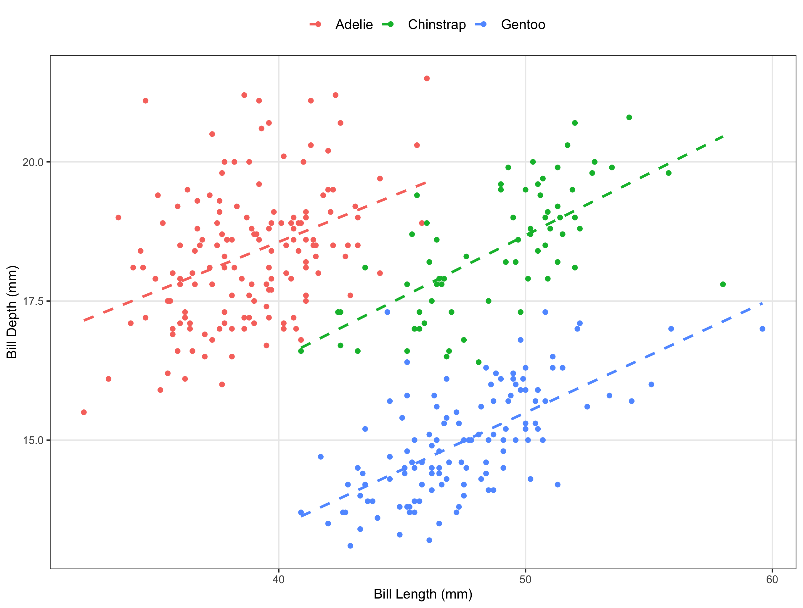
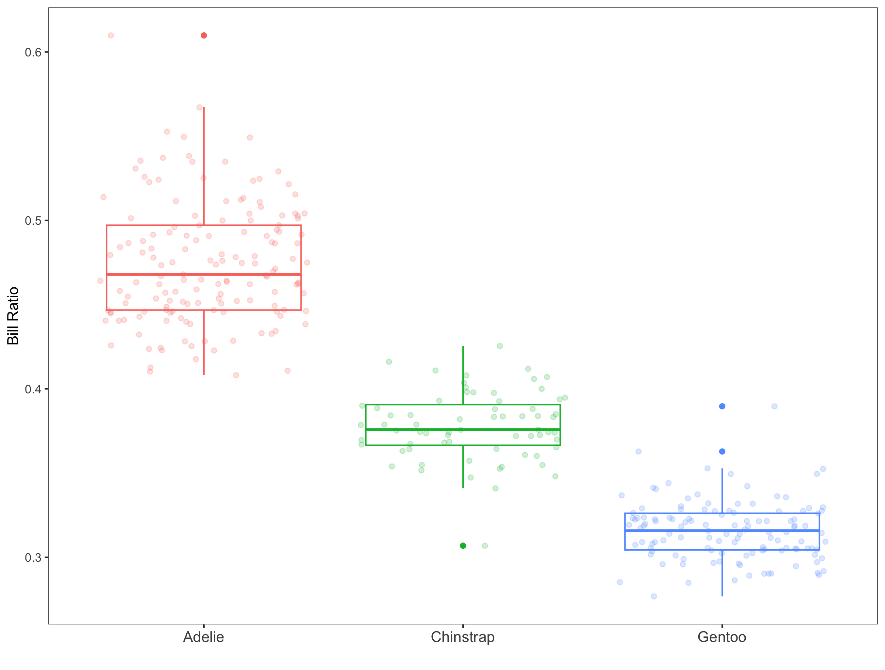

```{r setup, include=F}
library(tidyverse)
library(palmerpenguins)
library(GGally)
library(grateful)

get_pkgs_info(out.dir = "../05_references")
```

# Character displacement of bill ratio in penguins

Lucas Eckert^1\*^

1.  Department of Biology, McGill University, Montreal, QC, Canada

\*Corresponding Author

Email: lucas.eckert\@mail.mcgill.ca

# Abstract

# Introduction

Character displacement in Darwin's finches [@grant2006].

# Methods

The bill ratio was defined as follows:

$$
BillRatio = BillDepth \div BillLength
$$

```{r results='asis', echo=F}
cite_packages(output = "paragraph", out.dir = "../05_references/")

```

# Results

As expected, there is a positive relationship between bill length and depth in all three species of penguins (Figure 1).



The species also differ in mean bill ratio (Figure 2). Adelie penguins have the greatest bill ratio (mean = 0.474), followed by Chinstrap (mean = 0.378), then Gentoo (mean = 0.316). Significant differences were confirmed among all three species using pairwise T-tests.



# Discussion

# References
